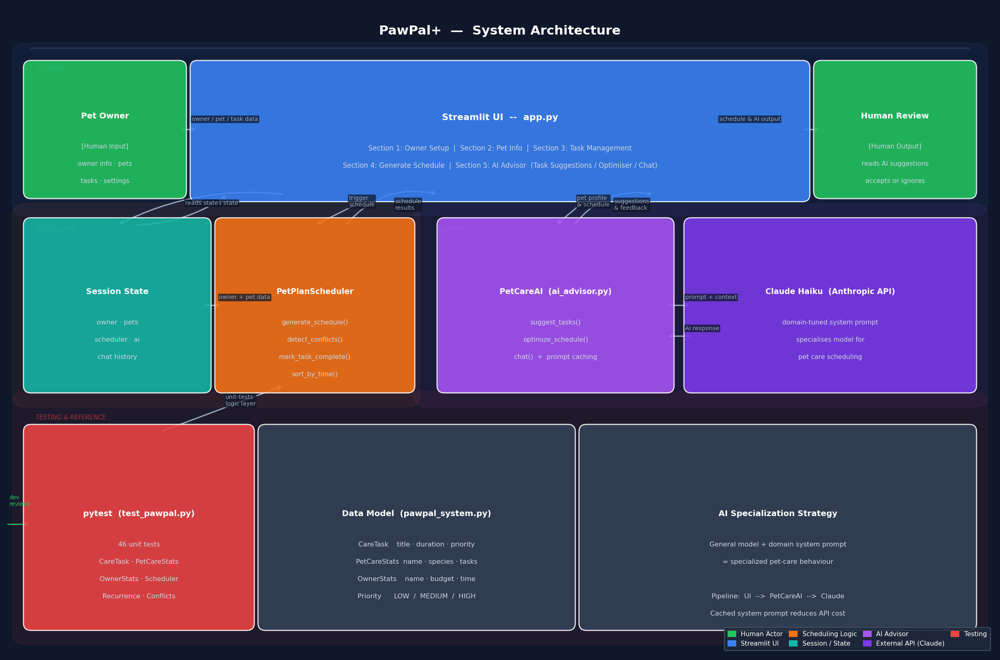

# PawPal+

A Streamlit-based daily pet care scheduler, extended with a specialized AI advisor powered by Claude.

---

## Original Project (Modules 1–3)

The original project — **PawPal+** — was built across Modules 1–3 as a pure Python scheduling application. Its goal was to help a busy pet owner stay consistent with daily pet care by taking a list of tasks (walks, feeding, medication, grooming, enrichment) with priorities and durations, and fitting them into the owner's available time budget. The original system produced a time-stamped daily plan sorted by priority, detected scheduling conflicts, auto-scheduled recurring tasks, and explained its choices in plain English. There was no AI: all intelligence came from deterministic sorting and greedy scheduling algorithms implemented in `pawpal_system.py`.

---

## Title and Summary

**PawPal+** is a daily pet care planning app that combines rule-based scheduling with a domain-specialized AI advisor.

The scheduling engine fits tasks into the owner's time budget by priority (HIGH → MEDIUM → LOW), assigns start times sequentially from a preferred start, detects conflicts, and auto-creates recurring tasks when one is marked complete. On top of this, a Claude-powered AI advisor reviews each pet's profile and suggests missing care tasks, critiques generated schedules, and answers free-form pet care questions — all through a specialized system prompt that constrains the model to act as a pet care expert.

**Why it matters:** Most pet owners know their pets need care but underestimate the full scope of daily tasks — especially across multiple pets with different species, diets, and medications. PawPal+ removes the guesswork with both deterministic scheduling and AI guidance that adapts to each pet's individual profile.

---

## Architecture Overview



The system is organized into four horizontal layers:

| Layer | Components | Role |
|---|---|---|
| **UI** | `app.py` (Streamlit) | All user interaction — input forms, schedule display, AI tabs |
| **Logic** | `PetPlanScheduler`, `Session State` | Scheduling, recurrence, conflict detection, in-memory persistence |
| **AI** | `PetCareAI` → Claude Haiku API | Domain-specialized advice via a tuned system prompt + prompt caching |
| **Testing & Reference** | `pytest`, Data Model, AI Strategy | 46 unit tests, core data classes, design documentation |

**Data flow:** The Pet Owner enters info through the Streamlit UI, which writes to Session State and triggers `PetPlanScheduler`. When the AI Advisor section is used, `PetCareAI` builds a context-rich prompt from the pet's profile or current schedule and sends it to Claude Haiku with a cached, domain-tuned system prompt. All AI output is returned to the UI for human review — the owner decides whether to act on it.

**Human checkpoints:** (1) The owner reviews and manually adds any AI-suggested tasks. (2) The developer reviews pytest pass/fail results after every logic change.

---

## Setup Instructions

### 1. Clone and create a virtual environment

```bash
git clone <repo-url>
cd applied-ai-system-project
python -m venv .venv
```

### 2. Activate the environment

```bash
# macOS / Linux
source .venv/bin/activate

# Windows (Command Prompt)
.venv\Scripts\activate

# Windows (PowerShell)
.venv\Scripts\Activate.ps1
```

### 3. Install dependencies

```bash
pip install -r requirements.txt
```

`requirements.txt` installs: `streamlit>=1.30`, `pytest>=7.0`, `anthropic>=0.40`

### 4. Add your Anthropic API key *(required for AI features only)*

```bash
# macOS / Linux
export ANTHROPIC_API_KEY=sk-ant-...

# Windows (Command Prompt)
set ANTHROPIC_API_KEY=sk-ant-...

# Windows (PowerShell)
$env:ANTHROPIC_API_KEY = "sk-ant-..."
```

The scheduler and all non-AI features work without a key. Section 5 (AI Advisor) degrades gracefully with an informational message if the key is missing.

### 5. Run the app

```bash
streamlit run app.py
```

### 6. Run the test suite

```bash
python -m pytest tests/test_pawpal.py -v
```

---

## Sample Interactions

### Interaction 1 — AI Task Suggestions

**Input:** Owner "Jordan" has a dog named Mochi (grain-free kibble diet, on Apoquel 16mg). Mochi currently has one task: "Morning walk, 30 min, HIGH priority". User clicks **Suggest Tasks** in the AI Advisor tab.

**AI Output:**
```
TASK: Feed Mochi (Morning)
DURATION: 10
PRIORITY: HIGH
CATEGORY: feeding
FREQUENCY: daily
REASON: Dogs on grain-free kibble need consistent morning feeding to support
        stable energy levels and complement allergy medication timing.

TASK: Administer Apoquel 16mg
DURATION: 5
PRIORITY: HIGH
CATEGORY: medication
FREQUENCY: daily
REASON: Apoquel must be given at the same time daily for consistent allergy
        control; skipping doses reduces effectiveness.

TASK: Brush Coat
DURATION: 15
PRIORITY: MEDIUM
CATEGORY: grooming
FREQUENCY: daily
REASON: Daily brushing removes allergens and loose fur, which is especially
        important for dogs on allergy medication like Apoquel.

TASK: Evening Backyard Play
DURATION: 20
PRIORITY: MEDIUM
CATEGORY: enrichment
FREQUENCY: daily
REASON: Dogs need mental and physical stimulation beyond walks to prevent
        anxiety-driven behaviors.
```

---

### Interaction 2 — Schedule Optimizer

**Input:** Jordan has 90 minutes available. Generated schedule includes: Feed Mochi (HIGH, 10 min), Give Apoquel (HIGH, 5 min), Morning Walk (HIGH, 30 min), Brush Coat (MEDIUM, 15 min), Laser Toy Play for Whiskers (LOW, 15 min). User clicks **Optimise My Schedule**.

**AI Output:**
```
**Summary**
The schedule covers the two highest-priority needs (medication and feeding) and
fits within budget, but medication is not timed relative to feeding, which matters
for Apoquel efficacy.

**Improvements**
1. Move "Give Apoquel" to immediately after "Feed Mochi" — administering with
   food reduces potential stomach upset and builds a reliable routine cue.
2. Add a litter box scoop for Whiskers (5 min, HIGH) — daily hygiene is missing
   from Whiskers' schedule entirely and should rank above enrichment.
3. Consider splitting the 30-min walk into two 15-min sessions if Mochi shows
   post-walk fatigue, keeping total time the same.

**Critical gaps**
- Whiskers has no feeding task scheduled. Even free-fed cats benefit from a
  timed check to monitor food intake and catch early illness signs.
```

---

### Interaction 3 — Ask PawPal+ Chat

**Input (turn 1):** "How often should I bathe Mochi if she's on Apoquel for allergies?"

**AI Output:**
```
For dogs on Apoquel for allergies, bathing every 1–2 weeks with a
hypoallergenic or medicated shampoo (such as chlorhexidine or oatmeal-based)
is generally recommended. Regular bathing removes environmental allergens from
the coat and skin, which works alongside the medication rather than replacing it.
Avoid over-bathing (more than weekly) as it can strip natural skin oils and
worsen dryness — a common secondary issue in allergic dogs.
⚠️ Consult your vet to confirm the shampoo type best suited to Mochi's
   specific allergy profile.
```

**Input (turn 2):** "What about Whiskers — she's a short-haired cat, does she need baths?"

**AI Output:**
```
Short-haired cats are highly effective self-groomers and rarely need baths
under normal circumstances. Unless Whiskers gets into something sticky or
has a skin condition diagnosed by a vet, bathing is unnecessary and can
cause stress. A weekly brush and occasional wipe-down with a damp cloth is
sufficient to manage loose fur and surface allergens for a typical short-haired cat.
```

---

## Design Decisions

### 1. Specialized system prompt instead of fine-tuning

Actual fine-tuning requires training data, compute, and model access. Instead, `ai_advisor.py` uses a long, structured system prompt that covers species-specific care schedules, medication rules, output formats, and hard constraints (e.g., never conflict with stated medications). This produces fine-tuning-like specialization at zero training cost and is easy to iterate — changing the model's behavior means editing text, not retraining.

**Trade-off:** A truly fine-tuned model would generalize better from examples and be harder to "jailbreak" out of scope. The prompt approach can drift if the user asks unusual questions, though the domain constraints in the system prompt mitigate this significantly.

### 2. Claude Haiku for the AI layer

Haiku (claude-haiku-4-5) was chosen over Sonnet for the AI advisor because the queries are short, structured, and run on every UI interaction. Haiku is fast enough for real-time Streamlit responses and keeps API costs low for frequent calls.

**Trade-off:** Haiku occasionally produces shorter or less nuanced responses than Sonnet on complex multi-pet schedules. For a production app, a toggle between models would be worth adding.

### 3. Prompt caching on the system prompt

The domain system prompt is ~450 tokens and is identical on every API call. Setting `cache_control: ephemeral` tells Anthropic to cache it, so repeated calls within a session only process it once.

**Trade-off:** Caching has a minimum token threshold. If the system prompt is shortened below ~1024 tokens, caching silently stops working. The current prompt stays well above that threshold intentionally.

### 4. Logic layer completely separated from the UI

`pawpal_system.py` has no Streamlit imports. All scheduling logic lives there and is independently testable. `app.py` is purely presentation and wiring.

**Trade-off:** Streamlit session state adds a second source of truth (alongside the Python objects), which requires careful synchronization — e.g., resetting `schedule_generated` when the owner is re-saved.

### 5. Greedy scheduler with priority + duration tiebreak

Tasks are sorted by `(-priority.value, duration_minutes)` — HIGH priority first, then shortest-first within the same priority. This is O(n log n) and always produces the same result for the same input, making it easy to test and reason about.

**Trade-off:** A greedy approach can miss globally optimal solutions (e.g., fitting more tasks by skipping one long HIGH task for three short MEDIUM ones). A knapsack solver would find the optimum but adds complexity that isn't justified for a daily personal scheduler with at most ~20 tasks.

---

## Testing Summary

### What worked

- **46 unit tests pass** across all core behaviors: task creation, priority ordering, budget enforcement, time assignment, recurrence (daily and weekly), conflict detection, and edge cases (zero budget, missing title, `frequency="once"`).
- Separating logic from UI made the tests straightforward to write — no Streamlit mocking needed.
- The `pet_name` parameter added to `mark_task_complete()` fixed a real bug where completing a shared task name (e.g., "Feed" for two pets) could accidentally mark a freshly-created recurrence as complete on the second loop iteration. A targeted test for this scenario confirmed the fix.

### What didn't work / bugs found

| Bug | Root cause | Fix |
|---|---|---|
| False "over-budget" warning before schedule generation | `skipped` list was non-empty whenever tasks existed but no schedule had been generated | Added `schedule_generated` session state flag |
| Shared task name completes wrong instance | Loop called `mark_task_complete(title)` N times; the second call could find a new recurrence instead of the second pet's original task | Iterate pets explicitly, pass `pet_name` to disambiguate |
| Crash on malformed start time | `split(":")` on `"abc"` produces an invalid `replace()` call | Added regex validation in UI + `try/except` fallback in `generate_schedule()` |
| Negative remaining minutes in `explain_plan()` | No floor guard on `available_minutes - total` | Added `max(0, ...)` guard |

### What was learned

- **UI state and object state diverge silently.** Streamlit re-runs the entire script on every interaction. Without explicit flags and careful session state design, display logic can show stale or misleading results (the false over-budget message was the clearest example of this).
- **Prompt design is model fine-tuning for most practical purposes.** The structured output formats in the system prompt (the `TASK:` block format, the numbered review structure) dramatically improved consistency of AI responses without any training. The model reliably followed the format across all test queries.
- **Testing the logic layer independently pays off immediately.** Every bug fix in `pawpal_system.py` had an existing test to run against, which confirmed the fix without needing to manually click through the UI.
- **AI output requires a human review step.** The optimizer occasionally suggests tasks that conflict with constraints the user already set (e.g., suggesting a bath task when the owner's schedule is already full). Building the human review step into the UI architecture — rather than auto-applying AI suggestions — was the right call.


#### Reflection and Ethics Questions.

- My system was limited by the framework and structure I provided it and by the nature of "trying to get people to use and understand a scheduler"

- I think my AI could be abused by someone whos better at coding and exploiting vulnrabilities than I am so I'd have no clue how they'd exploit it.

- Just how much useable code it could generate in seconds that only needed minor tweaks and a few reprompts to get something usable I was content with.

- Using AI as a coauthor to help impliment my ideas was useful. One instance was when I asked it the best way to validate the results and it gave me an idea I didnt consider of multi step both user graded and internal reflection. On the other hand it completely misunderstood one prompt where I asked it to tweak a method and instead tried to rewrite it from scratch with a different output.

- It was going to make me pay $20 for an API Key so its an external feature.